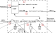

Technical overview
++++++++++++++++++

This chapter aims to give an overview of how SanicDNS works under the hood. To make sure the explanations stay close to the code and to allow the reader to dive deeper into the codebase of SanicDNS, all explanations will be linked to the responsible code.

   High-level overview of SanicDNS

The (very) high-level overview of the bruteforcer is presented in the image above. First, the input domains are read from an input file and combined with a couple of resolvers to form :struct:`Request`. A Request is the internal data structure that is used to distribute DNS requests to the workers (see :ref:`technical_overview_constructing_requests`). When these requests are formed they are distributed to workers through a DPDK Ringbuffer for maximum performance.

The workers are each capable of performing complete DNS requests, in accordance with the `Shared-nothing architecture <https://en.wikipedia.org/wiki/Shared-nothing_architecture>`_. By having each worker operate individually there is very little need for communication between the different workers. This improves the simplicity and performance of the design for a multi-threaded application since communication between different CPU cores can be tedious and resource-intensive. See :ref:`technical_overview_the_workers` for a complete overview of the functionality of the workers.

.. _technical_overview_constructing_requests:
Constructing requests
---------------------

A :struct:`Request` is the data structure used to pass DNS requests to workers that will take care of resolving the requests. It has the following structure:

.. doxygenstruct:: Request
   :project: SanicDNS
   :members:
   :undoc-members:

The parameters ``dst_mac``, ``src_ip`` and ``q_type`` are currently the same in each instance of the :struct:`Request` structure, it is assumed that the router configuration does not change during the runtime of the bruteforcer and ``q_type`` is filled from the user-provided question type.

To fetch domains from the input file with domains to resolve the :class:`InputReader` is used. This is an optimized `SIMD <https://en.wikipedia.org/wiki/Single_instruction,_multiple_data>`_ file reader that can return an individual domain from the input file using :func:`InputReader::GetDomain`. This input domain is read in the Request's ``name`` field.

.. _technical_overview_the_workers:
The Workers
-----------

To enhance performance and to ease the design challenge of the bruteforcer, each worker is its own mini DNS bruteforcer. Communication with other threads is kept to a minimum to prevent overhead and potential bugs from thread-to-thread communication. In the figure below the different steps are outlined that a worker takes to resolve a DNS request. The order of operations is shown as the order in which the operations are implemented in the bruteforcer code.

   Overview of the architecture of a worker

The worker repeats the steps 1 -> 7 in a loop. Every io operation is performed using the `DPDK Poll Mode Driver <https://doc.dpdk.org/guides/prog_guide/poll_mode_drv.html>`_, this is faster than the regular interrupt-driven IO used by Linux but has the downside of consuming max CPU resources at all time. 

In these steps the worker first executes the TX part and afterwards the RX part. It will process up to 32 packets per iteration in the TX part and 64 packets per iteration in the RX part (defined in :ref:`scanner_config.h<file_src_scanner_config.h>`). This is to ensure that the worker can handle more RX traffic than TX traffic. Each worker keeps it's internal state using the :struct:`WorkerContext` struct. 

.. .. doxygenstruct:: WorkerContext
..    :project: SanicDNS
..    :members:
..    :undoc-members:

#. **Worker TX: Timeout queue**
   
   When a worker enters the loop, it first checks whether any requests have reached the maximum timeout. It retrieves the requests that have been sent least recently by consuming the :member:`WorkerContext::timeout_list` queue from the back until it identifies a request that is under the timeout limit. These requests are added back into the :member:`WorkerContext::ready_for_send_list` queue so they will be retransmitted. For a more detailed overview of the timeout mechanism, see :ref:`technical_overview_timout_queue`.

#. **Worker TX: Fetch requests**

   After all timeouts have been submitted for retransmission, new Requests are fetched from the distribution ring. The requests all originate from the main thread that is responsible for parsing the input files and constructing the requests.

   The requests are put in a free spot in the :member:`WorkerContext::request_containers`. The worker can handle as many requests concurrently as there are spaces available in the request buffers. The worker needs to keep a copy of all requests currently in flight in order to be able to effectively handle retries. After the request is added to the request buffer, the request is added to the :member:`WorkerContext::ready_for_send_list` queue to schedule it for transmission.
   
#. **Packet construction and sending**

   In this step the requests in the :member:`WorkerContext::ready_for_send_list` queue are consumed, constructed and sent. In the :member:`WorkerContext::request_containers` all requests are saved in the :struct:`Request` format, when a request is transmitted, the DNS packet always needs to be constructed from scratch. The DNS packet is constructed using the :member:`DNSPacketConstructor::ConstructIpv4DNSPacket`.

   The rate-limiting system of the DNS bruteforcer is built into this step as well. Each worker has a rate-limit allowance of the total rate limit divided by the number of workers.

   After the requests have been constructed they are immediately offloaded onto the network interface for transmission using the :member:`EthRxTx::SendPackets` method.

#. **Receiving packets and packet parsing**

   When the worker enters the RX part of the loop, it first retrieves packets from the network interface using the :member:`EthRxTx::RcvPackets` method. It will immediately try to parse all packets into a :class:`DnsPacket` using the :member:`DNSPacket::init` function. The :class:`DNSPacket` class is an interface that is used to interact with the parsed packet.

#. **Packet redistribution**

   Since each worker operates as a mini bruteforcer it cannot process DNS requests that are meant for another worker. When the network interface cannot be reprogrammed to steer packets for workers into the designated worker RX queue, the workers have to distribute the packets in software. The software redistribution step is taken after the packets are parsed since it is easier to redistribute the packets using :member:`DNSPacket::dns_id` and :member:`DNSPacket::ip_data`. The step is displayed in a dashed line since software based packet redistribution is only necessary for :ref:`getting_started_af_xdp`.

   When software-based packet redistribution is necessary, each worker exposes a distribution ring where other workers can submit packets. When a worker has parsed a block of packets, it orders the packets per destination worker and submits the packets to the correct distribution queue.

#. **Packet matching**

   TODO

.. _technical_overview_timout_queue:
Timeout queue
-------------
TODO

.. _technical_overview_packet_distribution:
Packet redistribution
---------------------
TODO

.. _technical_overview_fetching_ips_and_mac_addresses:
Fetching IP and MAC addresses
---------------------
TODO